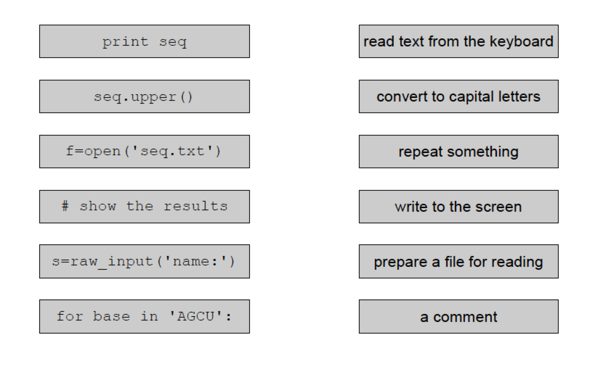
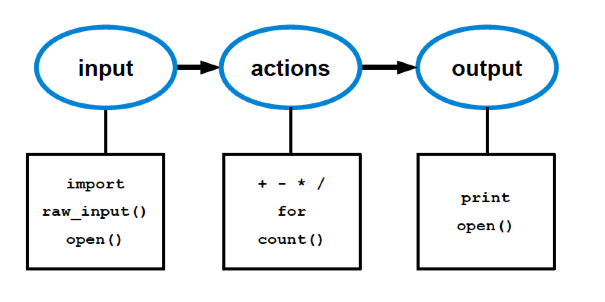

### How can I run a program? Input and output

In this module you can learn
-  How to read, process, and output text
-  How to read from the keyboard
-  How to write to the screen
-  How to repeat things
-  How to create your own modules

---

Challenge  

>
> *Game of instruction*
>
> You will be given the drawing of a shape and in group you should write instructions to draw the same shape from scratch
> The instructions will be given to another group that haven't seen the shape and should draw it following the instructions
>
---


---
Challenge  


>
>Questions for getting started (given to small groups on cards)

> + Write examples of 4 programs you know
> + What do programs do?
> + Write a definition of program.
>
---


## What is a program?
It is a text file that contains Python commands or, in other words, lines of code


---
Challenge  #1


>-  Open a text file, write: <br>
>- print `"This is the output of my first program"`
>- save the file with the name my_print.py and exit
>-  Open a terminal, go to the directory where you saved `my_print.py` and type at the cursor: `python my_print.py`
>
---


---
Challenge

> Your first Python commands: create pairs
>
---




## How programs work




## Input


## Input from the program itself
```python
a = 3
print a
```

## Input from the keyboard
```python
>>> a = raw_input("Type a number: ")
Type a number: 3
>>> print a
3
```
---
Challenge  #2

>Write a program that reads something from the keyboard and print it to the screen.
>
---


See See the [Solution to challenge #2](3_PythonPrograms.solutions.md)


## Input from a text file
-  We need to “access” an existing input file
-  And read its content


The input file `insuline.txt` can be found [here](data_and_scripts/1-PythonPrograms/d2_programing_data_scripts/insulin.txt)

```python
Infile = open("insulin.txt")

content = Infile.read()

print content
```

## From a Python module
-  A Python module is a text file (with the `.py` extension) that contains (Python) definitions/assignments
-   Python modules can be accessed from programs using the import statement


#### Python module insulin.py
```python
insulin = "GIVEQCCTSICSLYQLENYCNFVNQHLCGSHL\
VEALYLVCGERGFFYTPKT"
```
#### Python program my_first_import.py
```python
from insulin import insulin
print insulin
```
<br>

---
Challenge  #3


>Write a program that reads a sequence from a file and print it to the screen. Run it.
>
---


<br>


## Output


## To the computer screen
Which command we use?


## To a text file
-  We need to “open” a text file in the “writing”
mode
-  We have to write to it.

```python
from insulin import insulin

outfile = open("my_output.txt", "w")
outfile.write(insulin)
outfile.close()
```

<br>
<br>
>Challenge
---
>Your first Python commands: create pairs

>
----

<br>
<br>

---
Challenge  #4


>Calculate DNA base occurrences
>
>Write a program that counts how many times the four bases occur in a DNA sequence. The program should:
>-  Store the DNA sequence in a variable.
>-  Count how often each base occurs.
>-  Write all four numbers to the screen.
>Test it with a DNA sequence for which you know the result, for instance “AAAACCCGGT”. This approach makes it much easier to discover small program errors.
>
----

See See the [Solution to challenge #4](3_PythonPrograms.solutions.md)

<br/>

### Recap
-  string variables contain text
-  `print` writes to the screen
-  you can use functions to do things
-  you can enter text with `raw_input()`    
-  `write()` writes to an open file
-  for loops repeat commands
-  comments starts with `#` or `'''`

<br/>

### Back

Back to [main page](../index.md).
