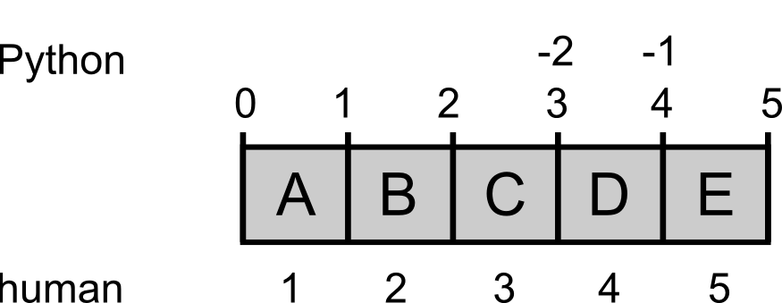

Back to [main page](../index.md).


# Parsing data records II


In many cases you will need to compare data from different files. As an example, consider the two files:

1) A Uniprot multiple sequence FASTA file `SwissProt-Human.fasta`, available [here](data_and_scripts/Parsing/SwissProt-Human.fasta).

```
SwissProt-Human.fasta
>sp|P31946|1433B_HUMAN 14-3-3 protein beta/alpha OS=Homo sapiens
MTMDKSELVQKAKLAEQAERYDDMAAAMKAVTEQGHELSNEERNLLSVAYKNVVGARRSS
WRVISSIEQKTERNEKKQQMGKEYREKIEAELQDICNDVLELLDKYLIPNATQPESKVFY
LKMKGDYFRYLSEVASGDNKQTTVSNSQQAYQEAFEISKKEMQPTHPIRLGLALNFSVFY
YEILNSPEKACSLAKTAFDEAIAELDTLNEESYKDSTLIMQLLRDNLTLWTSENQGDEGD
AGEGEN
>sp|P62258|1433E_HUMAN 14-3-3 protein epsilon OS=Homo sapiens
MDDREDLVYQAKLAEQAERYDEMVESMKKVAGMDVELTVEERNLLSVAYKNVIGARRASW
RIISSIEQKEENKGGEDKLKMIREYRQMVETELKLICCDILDVLDKHLIPAANTGESKVF
YYKMKGDYHRYLAEFATGNDRKEAAENSLVAYKAASDIAMTELPPTHPIRLGLALNFSVF
YYEILNSPDRACRLAKAAFDDAIAELDTLSEESYKDSTLIMQLLRDNLTLWTSDMQGDGE
EQNKEALQDVEDENQ
>sp|Q04917|1433F_HUMAN 14-3-3 protein eta OS=Homo sapiens GN=YWHAH
MGDREQLLQRARLAEQAERYDDMASAMKAVTELNEPLSNEDRNLLSVAYKNVVGARRSSW
RVISSIEQKTMADGNEKKLEKVKAYREKIEKELETVCNDVLSLLDKFLIKNCNDFQYESK
VFYLKMKGDYYRYLAEVASGEKKNSVVEASEAAYKEAFEISKEQMQPTHPIRLGLALNFS
VFYYEIQNAPEQACLLAKQAFDDAIAELDTLNEDSYKDSTLIMQLLRDNLTLWTSDQQDE
EAGEGN
...
...
...
```

2) A file `cancer-expressed.txt` containing a list of protein accession numbers (ACs), available [here](data_and_scripts/Parsing/cancer-expressed.txt):
```
Q5XXA6
Q9Y5P2
Q14667
O75387
Q8WV07
Q8CH62
Q9GZY1
Q9NQQ7
Q8VCX2
Q7Z769
```

In order to compare the content of the two files, you might first want to store the 10 Uniprot ID in a data structure. In practice:

+ Read 10 SwissProt ACs from the file
+ Store them in a data structure

**Lists** are nice and veeeeery flexible data structures

```
['Q5XXA6', 'Q9Y5P2', 'Q14667', 'O75387', 'Q8WV07','Q8CH62', 'Q9GZY1', 'Q9NQQ7', 'Q8VCX2', 'Q7Z769']
```

## List data structure

A list is a mutable ordered collection of objects

The elements of a list can be any kind of object:

- numbers
- strings
- tuples
- lists
- dictionaries
- function calls
- *etcetera*

```
L = [1, [2,3], 4.52, 'DNA']

L = []  # the empty list

```
## Operations with lists


```
>>> L = [1,"hello",12.1,[1,2,"three"],"seq",(1,2)]
>>> L[0]  # indexing
1
>>> L[3]  # indexing
[1, 2, 'three']
>>> L[3][2]  # indexing
'three'
>>> L[-1]  # negative indexing
(1, 2)
>>> L[2:4]
[12.1, [1, 2, 'three']]  # slicing
>>> L[2:]
[12.1, [1, 2, 'three'], 'seq', (1, 2)] #slicing shorthand
>>>
```


The elements of a list can be changed/replaced after the list has been defined **These operations CHANGE the list**


|        |
|--------|
|l[i] = x|
|l[i:j] = t|
|del l[i:j]|
|del l[i:j:k]|
|l.append(x)|
|l.extend(s)|

s = any sequence


```
>>> l = [2,3,5,7,8,['a','b'],'a','b','cde']
>>> l[0] = 1
>>> l
[1, 3, 5, 7, 8, ['a', 'b'], 'a', 'b', 'cde']
>>> l[0:3] = 'DNA'
>>> l
['D', 'N', 'A', 7, 8, ['a', 'b'], 'a', 'b', 'cde']
>>> del l[0:5]
>>> l
[['a', 'b'], 'a', 'b', 'cde']
>>> l.append('DNA')
>>> l
[['a', 'b'], 'a', 'b', 'cde', 'DNA']
>>> l.extend('dna')
>>> l
[['a', 'b'], 'a', 'b', 'cde', 'DNA', 'd', 'n', 'a']
>>>
```


The elements of a list can be changed/replaced after the list has been defined


| |
|--------|
|l.count(x)|
|l.index(x)|
|l.insert(i, x)|
|l.pop(i)
|l.remove(x)

```
>>> l = [1,3,5,7,8,['a','b'],'a','b','cde']
>>> l.count('a')
>>> l
1
>>> l.index(8)
4
>>> l.insert(4, 80)
>>> l
[1, 3, 5, 7, 80, 8, ['a', 'b'], 'a', 'b', 'cde']
>>> l.pop(4)
80
>>> l
[1, 3, 5, 7, 8, ['a', 'b'], 'a', 'b', 'cde']
>>> l.pop()
'cde'
>>> l
[1, 3, 5, 7, 8, ['a', 'b'], 'a', 'b']
>>> l.remove(8)
[1, 3, 5, 7, ['a', 'b'], 'a', 'b']
The elements of a list can be changed/replaced after the list has been defined
```


| |
|--------|
|l.reverse()|
|l.sort()|
|sorted(l)|

```
>>> l = [4, 3, 2, 1, 5, 6, 7, 8]
>>> l.reverse()
>>> l
[8, 7, 6, 5, 1, 2, 3, 4]
>>> new = sorted(l)
>>> new
[1, 2, 3, 4, 5, 6, 7, 8]
>>> l
[8, 7, 6, 5, 1, 2, 3, 4]
>>> l.sort()
>>> l
[1, 2, 3, 4, 5, 6, 7, 8]
```

## Putting together lists and loops

`range()` and `xrange()` built-in functions

```
>>> range(10)
[0, 1, 2, 3, 4, 5, 6, 7, 8, 9]
>>> range(1, 11)
[1, 2, 3, 4, 5, 6, 7, 8, 9, 10]
>>> range(0, 30, 5)
[0, 5, 10, 15, 20, 25]
>>> range(0, 10, 3)
[0, 3, 6, 9]
>>> range(0, -10, -1)
[0, -1, -2, -3, -4, -5, -6, -7, -8, -9]
>>> range(0)
[]
>>> range(1, 0)
[]
# the xrange()method is more commonly used in for loops than range()
>>>for i in xrange(5):
…             print i
…
0,1,2,3,4
```
The `xrange()` method generates the values upon call, i.e. it does not
store them into a variable


## Indexing



Computers treat an address in memory as the **starting point** of a body of data. In the same sense, an **index** in Python always refers to such a starting point, something that is **in between** two objects in memory. We humans in contrast always count the objects themselves.


---
Challenge #1

> Download the file `cancer-expressed.txt` form [here](data_and_scripts/Parsing/cancer-expressed.txt)
>+  Read 10 SwissProt ACs from a file
>+  Store them into a list
>+   Print the list
>
---


See the [Solution to challenge #1](7_Parsing-Theory-II.solutions.md)

---
Challenge #2

> Download the Uniprot multiple sequence FASTA file `SwissProt-Human.fasta` [here](data_and_scripts/Parsing/SwissProt-Human.fasta).
>+ Create a list containing Uniprot ACs extracted from the FASTA file
>+ Print the list
>
---


See the [Solution to challenge #2](7_Parsing-Theory-II.solutions.md)


---
Challenge #3
> Download the Uniprot multiple sequence FASTA file `SwissProt-Human.fasta` from [here](data_and_scripts/Parsing/SwissProt-Human.fasta).
> Download the file `cancer-expressed.txt` containing a list of ACs from [here](data_and_scripts/Parsing/cancer-expressed.txt)
>+  Read the ACs and store them in a pyton structure
>+  Read the human FASTA file one record after the other. Check if the record header contains one of the 10 ACs.
>+   If YES, copy the header to a new file.
>
----


See the [Solution to challenge #3](7_Parsing-Theory-II.solutions.md)


---
Challenge #4

>Download the Uniprot multiple sequence FASTA file `SwissProt-Human.fasta` from [here](data_and_scripts/Parsing/SwissProt-Human.fasta). Download the file `cancer-expressed.txt` containing a list of ACs from [here](data_and_scripts/Parsing/cancer-expressed.txt).
>+  Read the ACs and store them in a pyton structure
>+  Read the human FASTA file one record after the other. Check if the record header contains one of the 10 ACs.
>+   If YES, copy the header and the sequence to a new file.
>
----


See the [Solution to challenge #4](7_Parsing-Theory-II.solutions.md)


## Putting together conditions and loops `while` loops
The while statement is used for executing a set of statements until a given  condition is met


    **while <condition 1>:
    <statements 1>**


```
>>> a = 1
>>> while a < 5:
...     print a,
...     a = a + 1
```

BUT:
```
>>> a = 1
>>> while a > 0:
...     if a == 5: break
...     print a,
...     a = a + 1
... else: print "loop terminated"
...
1 2 3 4
```

## The Boolean values `True` and `False`
`if` and `while` statements return a `False` value when they are applied to:

- None
- 0
- Empty data structures: '',(),[],{}

The statements in an `if` or a `while` block are executed only if the condition returns the value `True`.

```
>>> p = 'protein'
>>> if p: print 'True'
...
True
>>> n = 0
>>> while 1:
...     print n,
...     n = n + 1
...     if n > 5: break
...
0 1 2 3 4 5
>>>
```

We can use while loops to read files
(but usually we won't do it):

```
cancer_file = open('cancer-expressed.txt')

cancer_list = []
line = cancer_file.readline()
while line:
  AC = line.strip()
  cancer_list.append(AC)
  line = cancer_file.readline()
```

Back to [main page](../index.md).
