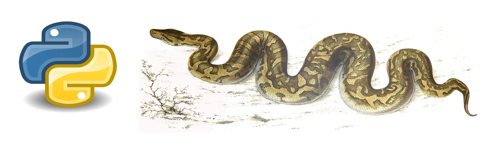

### Course Description

Python is an object-oriented programming language that is ideal for biological data analysis. The course will start from zero knowledge, and will introduce the participants to all the basic concepts of Python such as calculating, organizing data, reading and writing files, program logic and writing larger programs. All the examples and practical sessions will focus on solving biological problems. In particular the sessions will cover:

+ working with DNA and protein sequences
+ data retrieval from files and their manipulation
+ running applications, such as BLAST, locally and from a script
+ finding motifs in sequence
+ parsing common file formats (Uniprot, GenBank, PDB, BLAST) with Biopython
+ ways to find and correct program errors

The course will be highly interactive and the students will continuously put theory into practice while learning. By the end of the course, the participants will have a good understanding of Python basics and will have acquired the skills to manage any type of bioinformatics database record and to run applications from scripts. Basic Unix/Linux skills will be provided at the beginning of the course.

### Target Audience
End-users of bioinformatics databases and tools that need to manage large files and/or a large number of files and aim at developing hands-on capabilities for their analysis by writing their own or adapting somebody else's scripts in an autonomous way.

### Course Pre-requisites
Basic familiarity with bioinformatics data resources such as Uniprot/Swiss-Prot, Blast, ENSEMBL, PDB, etc. The course is directed to biologists with little or no programming experience and aims at making them capable to use Python to autonomously manage and analyse biological data.

Participants are asked to take a look at [pre-course reading material on the Unix/Linux command line](https://rawgit.com/BioinformaticsTraining/Critical-Guides/gh-pages/HTML/Flip_Day0.html) *before* the course, so that we can avoid wasting valuable training time and enter the core subject almost directly, after a brief discussion.

### Detailed Program

#### Day 1
##### [Intro](assets/1_intro.md) | [Python Shell](assets/2_pythonshell.md) | [Python Programs](assets/3_PythonPrograms.md) | [Structures and Modules](assets/4_PythonStructureModulesImport.md)

#### Day 2

<!-- -->

##### Flipped Lesson: Homework [Loops](https://rawgit.com/BioinformaticsTraining/Critical-Guides/gh-pages/HTML/Flip_Day1.html) | In class assessment

#### [Repeating Things](assets/RepeatingThings.md) | [File Formats](assets/5_FileFormats.md) | [Parsing I](assets/6_Parsing-Theory-I.md) | [Parsing II](assets/7_Parsing-Theory-II.md)  

#### Day 3

##### Flipped Lesson: Homework [Functions](https://rawgit.com/BioinformaticsTraining/Critical-Guides/gh-pages/HTML/Flip_Day2.html)  | In class assessment

##### [Functions](assets/8_functions.md) | [Best Practices](assets/9_BestPracticesInProgramming.md) |[Error Handling](assets/10_ErrorHandling.md) | [Data Columns](assets/11_DataColumns.md) | [Tabular Data](assets/12_TabularData.md)

#### Day 4
##### [Data Searching](assets/13_DataSearching.md) | [BLAST Pipeline](assets/15_Running-BLAST_sys.argv.md) | [Python libraries](assets/16_tasks.md)

#### Day 5
##### [Hackaton](assets/HACKATHON_TASKS.md)

---

---

### [Learning objectives](pages/learning_objective.html)

### [Instructors](pages/instructors.md)

---

### This course was taught at:

- [PPB17 Programming in Python for Biologists](ftp://gtpb.igc.gulbenkian.pt/bicourses/2017/PPB17/index.html) Oeiras - Portugal -  November 27-30 2017
- [Python for Life Scientists](https://elixir-iib-training.github.io/website/docs/programme2016_copy.html) Bari - Italy - September 26-30 2016
- [BPBR16 Programming in Python for Biologists](http://gtpb.igc.gulbenkian.pt/bicourses/BPBR16/) Oeiras - Portugal - July 11-15 2016

The source for this course webpage is [on github](https://github.com/GTPB/Web_course_template).
