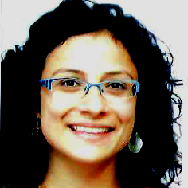
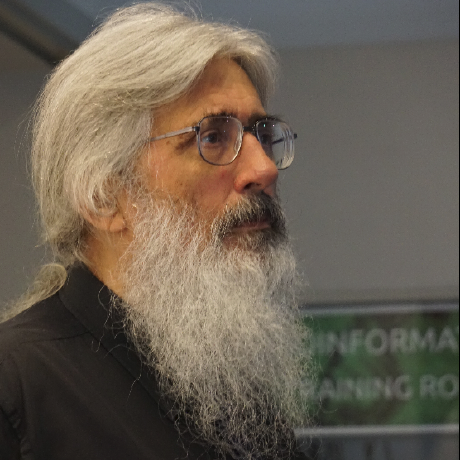

## Allegra Via
**Affiliation:** Institute of Molecular Biology and Pathology (IBPM) of the National Research Council (CNR, Rome, IT)

[**Allegra Via**](https://elixir-iib-training.github.io/website/instructors/allegra_via.html) is a physicist and scientific researcher at the Institute of Molecular Biology and Pathology (IBPM) of the National Research Council (CNR, Rome, IT). In 2003, she obtained a PhD at the University of Rome "Tor Vergata", where she also worked for six years as a postdoc. 

In 2009 she moved to the "Sapienza University" as researcher, and, since January 2014, she is the Training Coordinator of ELIXIR Italy. She is involved in the design, organisation and delivery of bioinformatics training courses, in Train the Trainer activities where she co-heads the Train-the-Trainer subtask in the EXCELERATE project, and collaborates with other ELIXIR nodes on many training-related initiatives. She has a long track record of academic teaching (Macromolecular Structures, Python programming, Bioinformatics, Biochemistry, Protein interactions). 

Her main research interests include protein structural bioinformatics, protein structure and function prediction and analysis, and protein interactions. Additionally, she is strongly interested in what researchers have discovered about how people learn, how to do the best to best teach them, and how research findings in the science of learning (educational psychology) can be translated into common teaching practice. 

She is a member of the Global Organisation of Bioinformatics Learning, Education and Training (GOBLET), a Software/Data Carpentry Instructor and Instructor trainer. She collaborates in GTPB since 2010 as a course designer and instructor, specifically in the provision of face-to-face courses on Programming in Python.

---

### Vincenza Colonna
**Affiliation:** Institute of Genetics and Biophysics, CNR, Napoli, IT

[**Vincenza Colonna**](http://www.igb.cnr.it/popgenlab) is a group leader at the Institue of Genetics and Biophysics of the Italian National Research Council in Napoli, Italy. She works in human genomics and her main research interests are natural selection and consanguineous populations. 

She graduated from University of Napoli Federico II (Italy) and did postdoctoral work at University of Ferrara (Italy) and at the Wellcome Trust Sanger Institute (UK). She was lecturer in Genetics and Bioinformatics at the University of Ferrara (Italy). 

She is also leading the [ObiLab project](http://www.igb.cnr.it/obilab) on training in bioinformatics. She is an instructor for ELIXIR-ITA and Software/Data Carpentry. She is also involved as collaborator and instructor in the ELIXIR-EXCELERATE Train the Trainer activities.

---

### David P. Judge
**Affiliation:** Former manager of Bioinformatics Training, University of Cambridge, Cambridge, UK

**David P. Judge** is a Computer Scientist who has taught Bioinformatics since 1985. He initiated the University of Cambridge Bioinformatics Training Facilty, providing the necessary environment for graduate and undergraduate courses.

He has also been involved with training programmes at the European Bioinformatics Institute, the Wellcome Trust Sanger Institute and the Instituto Gulbenkian de Ciência (IGC) through GTPB. He currently teaches Bioinformatics in several international training programmes and is regularly invited to teach in many places in Europe, Asia, Africa and America. 

His course notes and exercises are well known to the international community of Bioinformatics professionals and users, many of whom (difficult to count) have had their first contact with Bioinformatics through him. David helped to pioneer Bioinformatics Training at the IGC in 1989, as part of an MSc course. Since its inception in 1999, he has contributed to the GTPB several times per year.
Affiliation: Freelance independent Bioinformatics instructor.

 

Back to [main page](../index.md).
